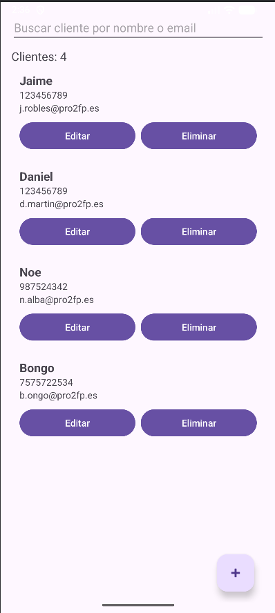
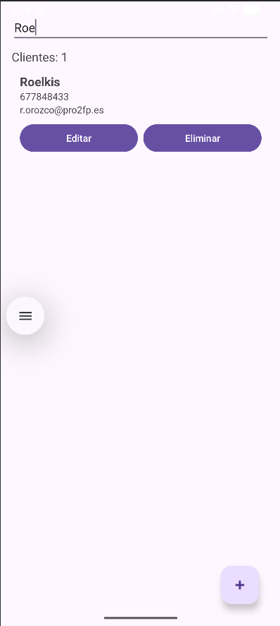
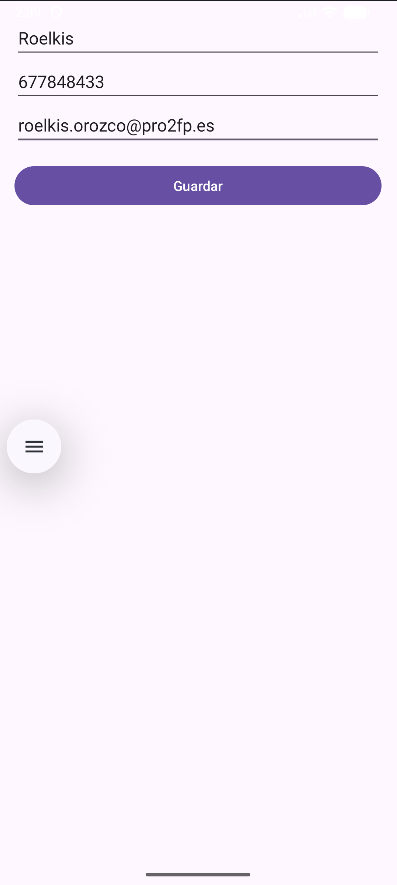
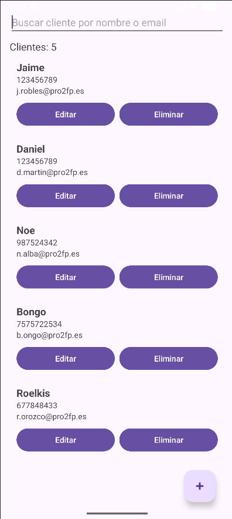
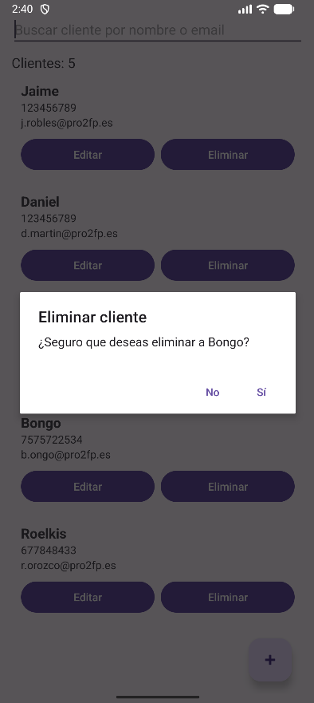
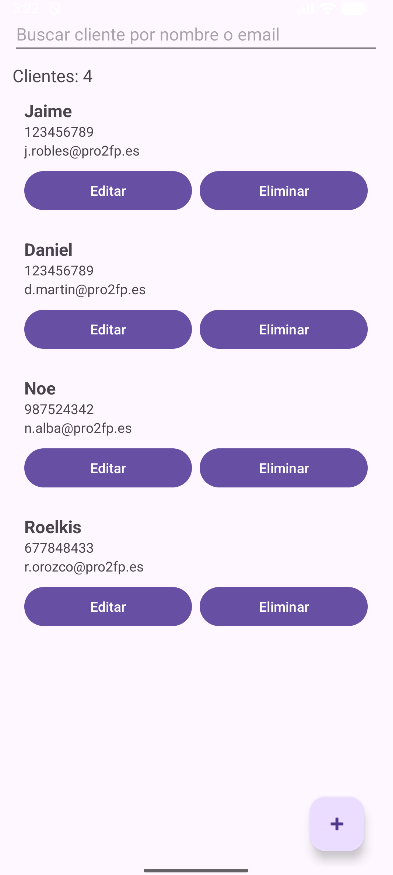

# Gestor de Clientes

Aplicación Android desarrollada en **Kotlin** para gestionar clientes de forma local. Permite agregar, editar, eliminar y buscar clientes utilizando **SQLite** para persistencia de datos. La interfaz incluye un RecyclerView moderno, contador de clientes y búsqueda en tiempo real.

---

## Funcionalidades

- **Pantalla principal**
  - Lista de clientes en un **RecyclerView** (nombre, email, teléfono)
  - Contador de clientes
  - **FloatingActionButton** para agregar nuevos clientes
  - Búsqueda en tiempo real por nombre o email
  - Botones **Editar** y **Eliminar** en cada cliente

- **Formulario de cliente**
  - Campos obligatorios: nombre, email y teléfono
  - Validación de formato de email
  - Validación de teléfono (mínimo 9 dígitos)
  - Inserta o actualiza cliente en la base de datos

- **Persistencia**
  - Guardado de clientes en **SQLite** usando `SQLiteOpenHelper`
  - Carga automática de clientes al iniciar la aplicación

---

## Capturas de pantalla

**Pantalla principal con lista:**



**Formulario de cliente agregar y busqueda:**




**Formulario editar y borrar:**






---

## Instalación

1. Clonar el repositorio:

```bash
git clone https://github.com/Jaimotas/Gestor-de-Clientes.git
